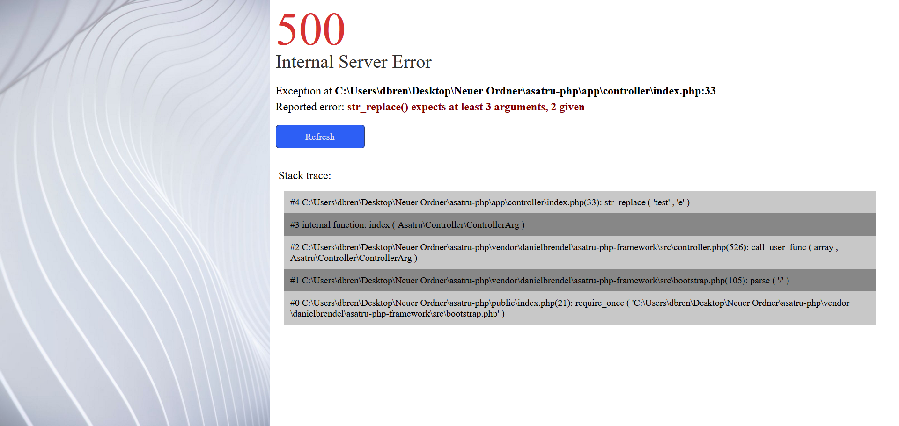
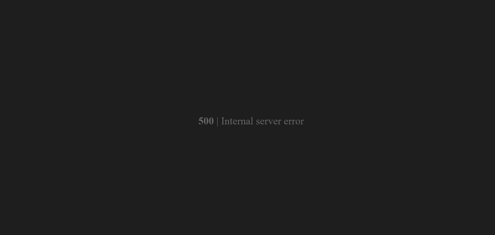

# Exceptions

You may want to throw exceptions from time to time. The framework has an exception
handler installed. You can control its behaviour via the <b>APP_DEBUG</b> variable (located in
your .env file). If this variable is set to true then every output of an exception will show on
as output in your browser. You can edit the layout if you want in the file

```
app/views/error/exception_debug.php.
```



If it is set to false (or does not exist) then there will just be an error shown
in your browser. This is useful to hide those debug messages from your clients. You
can edit its layout in the file 

```
app/views/error/exception_prod.php.
```



Exceptions are also appended to the log buffer.
